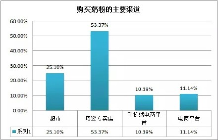

# 母婴行业关于产品的思考-1

## 1.用户分析

### 1.1 用户的年轻化、高知化、高收入化。

以上数据来自妈妈网，基本可代表现在互联网上的妈妈用户。由上述数据可知，现在互联网妈妈用户以80后、90后，3岁以前妈妈为主。大学本科及以上占80%。家庭年收入10W以上占57%。

这类用户的特点是

1、信息筛选能力强。知识面接触面都较广泛，B格不够高的很难满足其需求。

2、对生活质量要求提高，孩子的事要求更高。

### 1.2 用户需求碎片化，区隔化。

母婴产品用户的主要需求有如下：

1、记录：宝宝照片、成长日历之类的

2、知识：孕期知识，育儿健康知识等。目前存在的有两种类型(1)、专业的，专家指导，如崔玉涛郑玉巧等。（2）经验的，来自其他妈妈的育儿经验。

3、社交：晒娃啊、吐槽啊、聊天啊、八卦啊什么的。

4、消费：谁家填个新的小生命不得购置一堆新的东西。

这四个都是刚需，需求优先级如下：购物>社交>知识>记录。

购物肯定是首位的需求，谁家要有宝宝了第一个想的不是我要给宝宝准备点什么？

其次是社交，怀孕晒晒肚皮啊，娃出来了晒晒娃，吐槽一下我这么辛苦我老公不知道照顾我天天打游戏啊什么的。

再次是知识，不过随着我们用户群体的高知化，这一需求正在与日俱增。

最后是记录，这一需求，初为人父母可能很感兴趣，但是基本都是三分钟热度。

无论哪个需求，用户需求的区隔化非常明显，基本不会再关心以前的。比如两岁孩子的妈妈肯定最关心自己孩子“同龄+”的信息，两岁的信息最关心，偶尔关心下两岁以后的信息，以前的信息基本不会再关注，除非生了二胎 ; -)

### 1.3 用户消费能力强、周期长

以上数据来自2014年度中国母婴人群消费行为研究报告。国家已经放开单独二胎政策，接下来可能全面放开二胎政策。由上述数据可知，约70%父母希望不止有一个宝宝，现在的主要用户群体是80后、90后，随着二胎政策的放开，70后也将会被拉入我们的用户群体，在大宝二宝三宝四宝。。。。没长大之前，宝宝或孕期产品都将是这部分用户的主要消费方向。

### 1.4 用户的消费需求不再以“便宜”为第一位，品质保证，价格实惠才是第一位购买标准。

以上数据来自妈妈网，由上述数据可知，妈妈们选择商品时关注价格和促销的比例如下：奶粉7.01%，尿不湿17.59%，辅食3.11%，洗护用品0.72%。

随着知识水平和收入水平的提高，随着优生优育知识的传播，以及妈妈们对孩子的重视程度日益提高。妈妈们选择商品的原则已经发生了变化，便宜已经不再是第一位。现在放在前面的是 “品质”“安全”“品牌”，在满足上述需求的前提下如果能以优惠的价格买到满意的产品当然是最好不过。

### 1.5 满足用户需求的产品

怀孕了、生娃了、知道该买些什么东西吗？不知道，找我！

知道宝宝用品如何选购如何使用吗？不知道，找我！

知道哪些品牌口碑最好、性价比最高吗？不知道，找我！

知道上哪能以全网最低价买到这些商品吗？不知道，找我！

想方便省心的把东西买回家吗？想，找我！

## 2.根据用户行为设计好的产品

### 2.1 手机端平台将会是用户消费的最佳渠道

以上数据来自2014年度中国母婴人群消费行为研究报告，由上述数据可知，现在购买母婴类产品的主要渠道集中在手机端电商平台、电商平台与产品专卖店。分别占比32.36%，22.88%、23.72%。手机端的比例肯定还会有进一步提高。

手机购物因为其便捷性会占绝对的主导。首先带娃的妈妈三头六臂都不够忙的，购物只能利用碎片化的时间，手机的小巧便捷完美的满足这一需求。其次信息丰富。大部分母婴产品知识和品牌信息都是从手机上获得。据宝宝树数据调查显示，妈妈们获取母婴类产品和品牌信息70.94%是通过手机网络，传统网络和电视分别占18.29%和8.63%。

### 2.2 手机电商最需要解决的问题

以上数据来自2014年度中国母婴人群消费行为研究报告，由数据可知，用户最不愿网购的商品奶粉和辅食和婴儿用品加起来占到75%，超过50%的人依然愿意去母婴店购买奶粉，因为这些都是“吃到肚子里的”，说到底还是对“品质”和“安全”的需求，主要怕网上假货多。所以做母婴行业首要解决的问题是“信任”问题。

由图可知。手机端母婴购物平台除了“品质和安全”的问题以外，最重要的需求就是“帮用户方便快捷的找到价格最低且适合用户的商品”

## 3.机会点

### 3.1 做中高端用户

选择中高端用户原因如下：

（1）中高端用户消费能力强，电商的主要消费群体本身就是中高端用户居多。

（2）中高端用户影响力强，辐射面广。做好了这部分用户，口碑就起来了。

上述数据来自妈妈网，用户本身就偏向中高端，如果是中低端用户，通过亲朋好友获取信息的比例可能占到更大。同一个问题，如果你同时咨询了一个城市白领妈妈和一个农村主妇妈妈，你选择相信谁多一些？同一款产品你卖给一个城市白领妈妈，她可能通过微信微博等各种交际渠道帮你散播出去，农村主妇妈妈可能也就是告诉了某闺蜜。所以我认为先做中高端用户，做好口碑，然后想办法用中高端用户来带动中低端用户。

### 3.2 导购很重要，与知识结合的导购更重要

随着用户的高知化，用户对生活质量的高要求化，知识的需求变的日益重要。但是知识的传播决不能是生硬的传播。传播也要传播的不知不觉让人如沐春风，要传播的有情怀。

1、蜜芽宝贝的超级清单

蜜芽宝贝的超级清单利用了知识传播的第二种类型，妈妈们的经验。即满足了妈妈们想获取知识的需求，也满足了妈妈们将自己已有知识散播出去的需求。

2、蜜芽宝贝的蜜芽圈

把互动和知识结合到了一起。

3、蜜芽宝贝的蜜芽大赏

低调的传播了母婴品牌信息。

4、蜜芽宝贝的特卖活动

设计的很有feel，和其他电商网站就是扔两个商品的照片上去的形式完全不同。很有情怀的结合了当下热点信息以及母婴知识需求热点。有一个问题是，她虽结合了热点，但是并没有实质上的知识传播，比如他写的“科学坐月子关键技能get”，但是实际上点进去并不能get到关键技能。只有几个商品而已。

蜜芽宝贝知识和购物的结合形式非常值得借鉴，如果要做中高端用户，情怀和走心很重要。

### 3.3 注重非标品，这才是赚钱的点。

请注意现在特火的贝贝网的首页面上就给了奶粉和尿不湿那两小旮地方，热门特卖里面几乎全部都是非标品。

### 3.4 转换视角，不止做母婴，而是做一群妈妈的生意

请注意活动专区里面妈妈化妆品的活动

请注意右上角的女装、居家和美妆。

妈妈们的需求母婴肯定是最主要的，但其他也不是没有，起码还有自己减肥臭美的需求，还有这个年龄段的妈妈，除了下有小，还有上有老的需求。可以以母婴为主，其他的为辅助，以延长用户的生命周期，避免每过一年失去大批用户的情况出现。

