# 母婴产品品牌总结  郝杰

数据来源

（1）自身经验和身边的妈妈

（2）各大电商平台

欢迎补充修正

# 1、米粉辅食品牌

1、嘉宝 Gerber（美国）

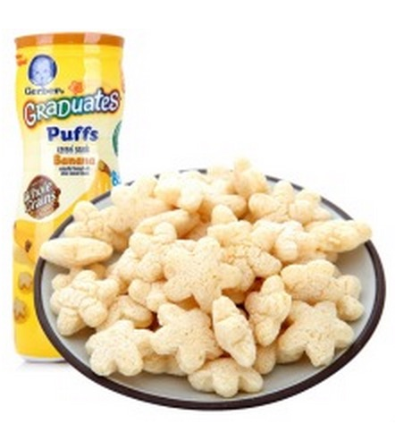

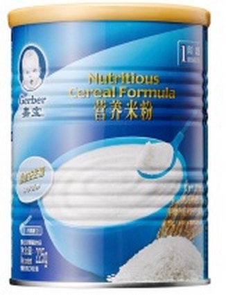

2、亨氏 Heinz （美国）

3、喜宝 HIPP （德国）

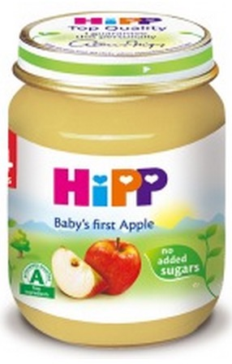

4、Earth's best （美国）

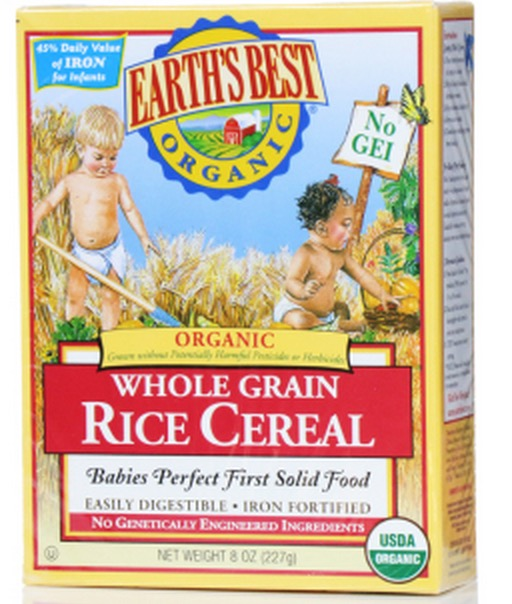

5、特福芬 Topfer （德国）

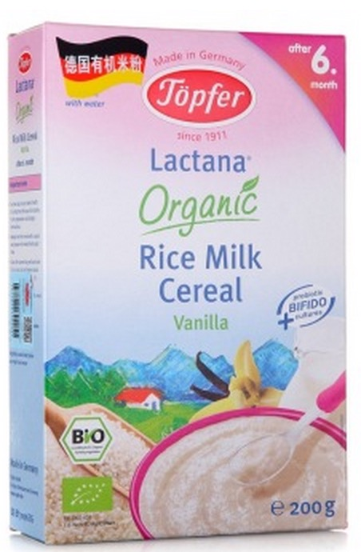

6、禧贝 happybaby （美国）

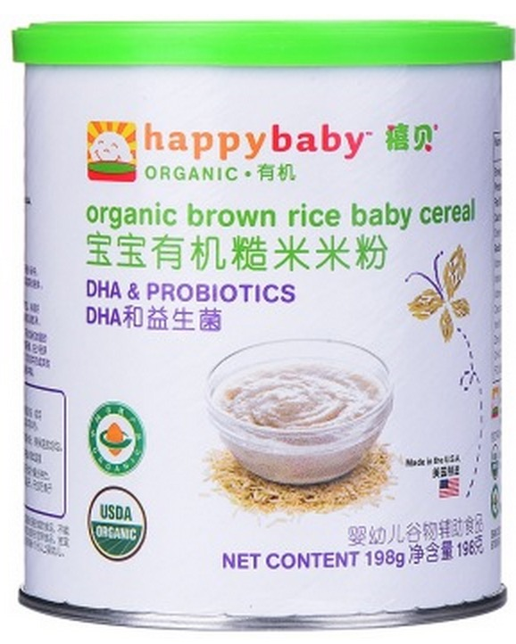

7、和光堂 （日本）

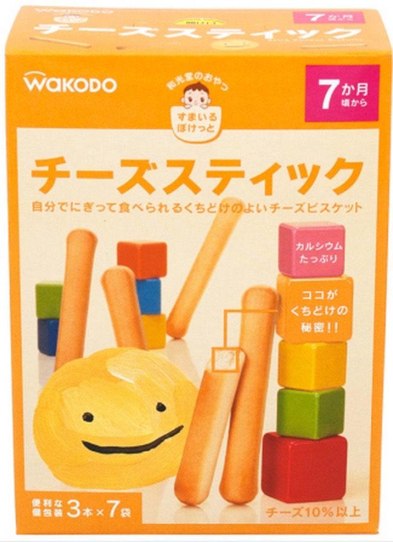

8、明治 （日本）

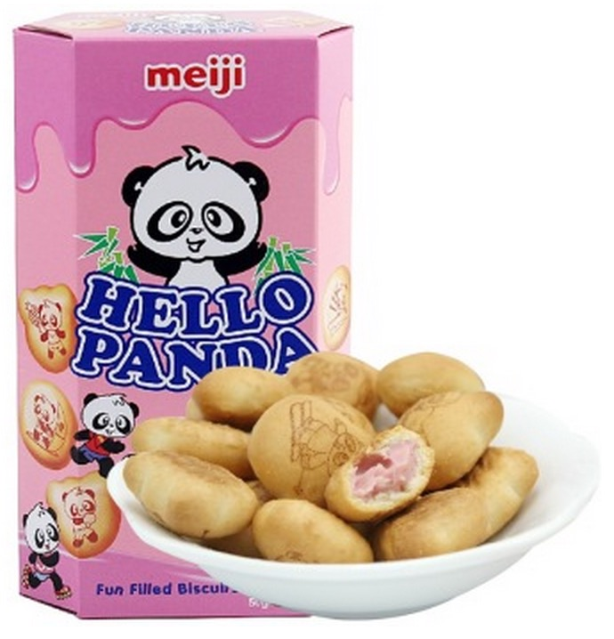

9、雀巢 Nestle（瑞士）

10、贝拉米 bellamy‘s

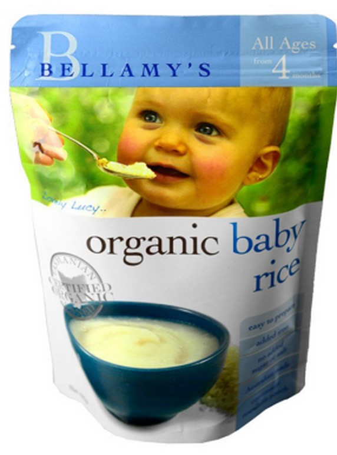

国产品牌：

9、英吉利 

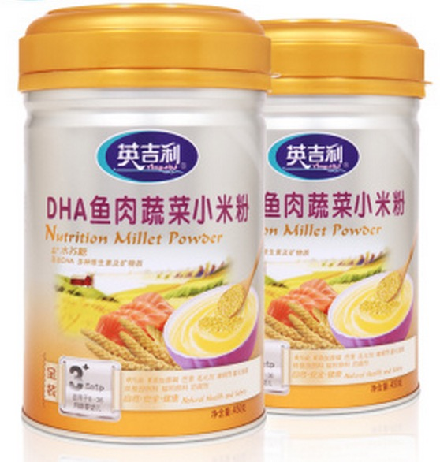

10、伊威 Eastwes (上海)

贝因美（杭州），方广（上海），味全（台湾），圣元（山东），合生元（广东），雅士利（广东），飞鹤（黑龙江），英氏，多美滋

# 2、儿童服装品牌

1、gap（美国）

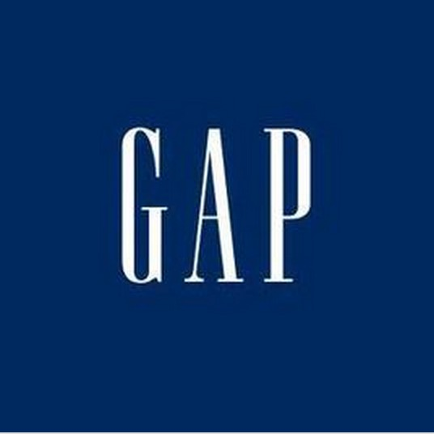

旗下拥有GAP、Banana Republic、Old Navy、Piperlime、Athleta五个品牌

官网：http://www.gap.cn/

2、carter‘s（美国）

美国童装的领导品牌。

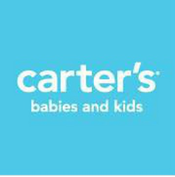

官网：http://www.carters.cn/

3、Gymboree 金宝贝（美国）

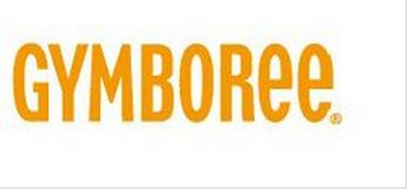

http://shop.gymboree.com.cn/

4、Mothercare （英国）

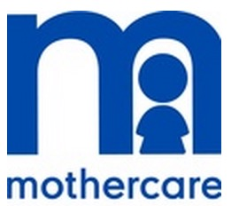

官网：http://cn.mothercare.com/

5、H&M（瑞典）

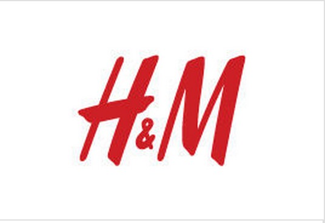

官网：http://www2.hm.com/zh_cn/kids.html

6、 RALPH LAUREN （美国）

官网：http://www.ralphlauren.com/shop/index.jspcategoryId=1760783&ab=global_children

7、Disney （美国）

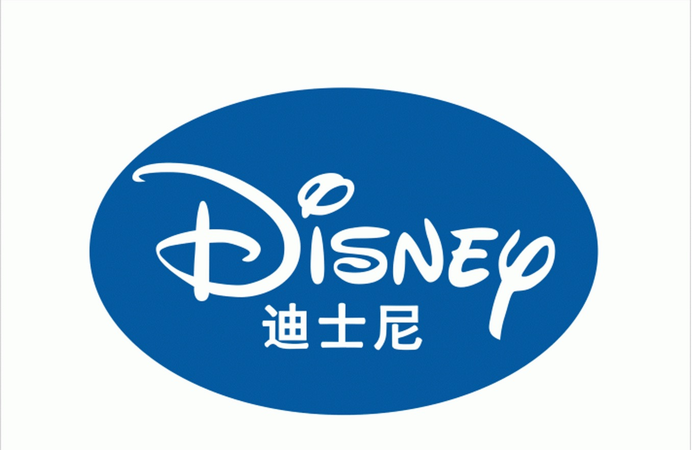

8、Yeehoo 英氏（中国高端）

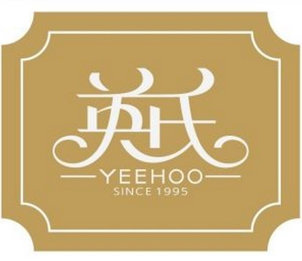

9、bobdog 巴布豆 （中国）

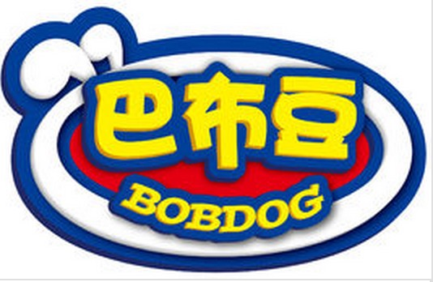

10、其他国外品牌

大嘴猴（Paul Homme）、ZARA、jeep、优衣库 OSHKOSH B'GOSH（美国） CK

11、国产品牌

巴拉巴拉、童泰、贝贝怡、优贝宜、丽婴房、小猪班纳、全棉时代、乐桃

服装品牌总结及建议

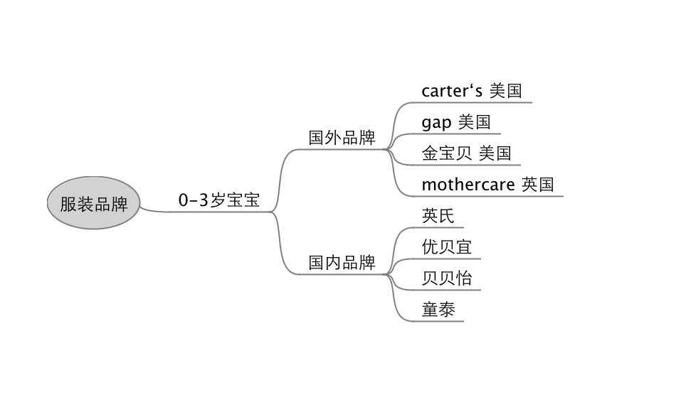

强调0-3岁宝宝服装品牌原因

（1）0-3岁宝宝皮肤娇嫩，且处于新妈妈母性大发的时刻，这个阶段基本都不遗余力的给宝宝买贵的好的。

（2）这个阶段宝宝长的最快，衣服替换频率高、孩子破坏力高，需要频繁购买。

（3）建议9点特卖将幼儿服装和童装分开。幼儿服装可推荐一些品质较佳的国产品牌。发现尽量推荐品牌产品。

# 3、玩具

1、费雪 Fisher-Price （美国）

0-3岁宝宝玩具居多

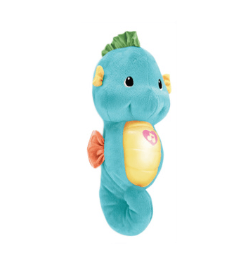 

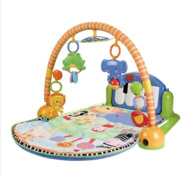

2、弗雷德 Freds Swim Academy（美国）

以游泳产品为主

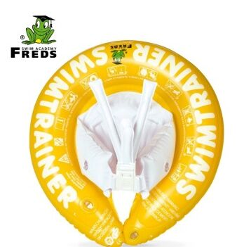

3、皇室 Toyroyal （日本）

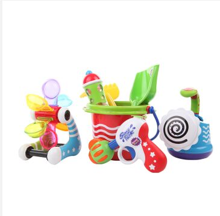

4、Hape （德国）以木玩为主

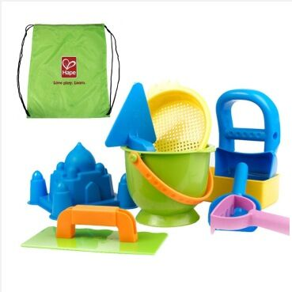

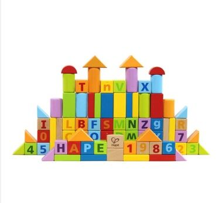

5、小泰克 littletikes （美国）

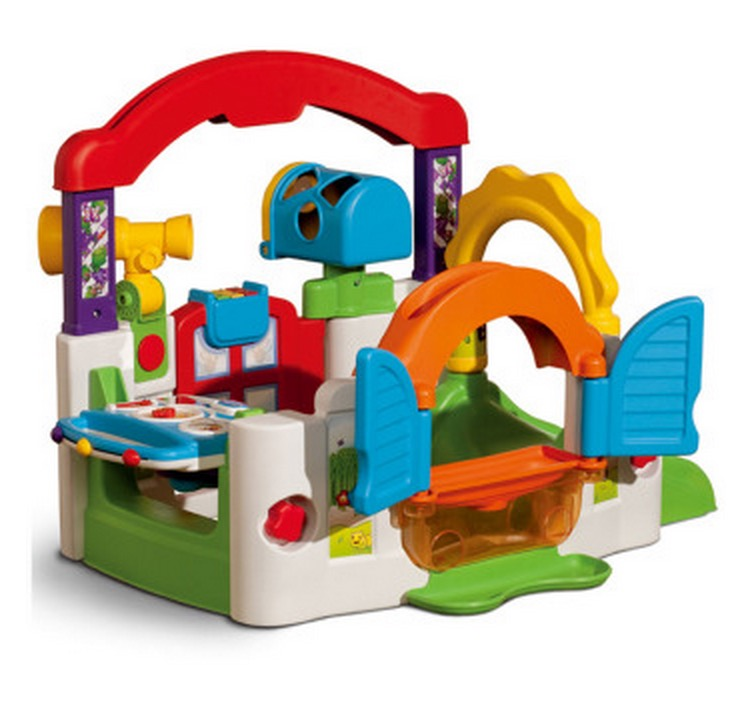

6、托马斯和朋友们 Thomas＆Friends （美国）

托马斯小火车相关玩具为主

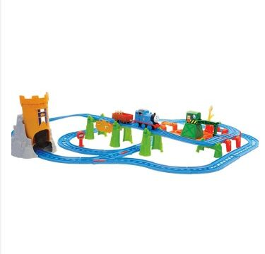

5、高盛KOS GROUP （英国） 

行李箱比较火

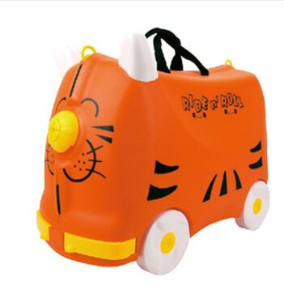

6、Acool （加拿大） 

以木玩为主

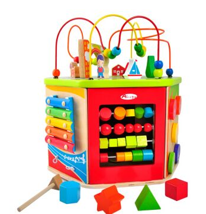

7、麦肯齐 （Munchkin）

以洗澡玩具居多

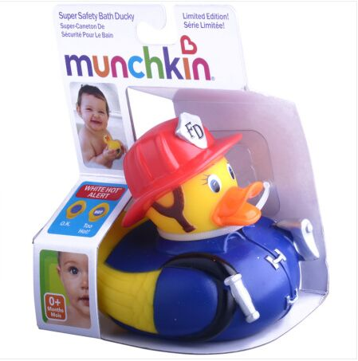

8、SHILOH 

高端毛绒玩具

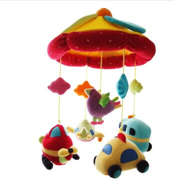

9、匹诺曹 Pinocchio （日本）

这家彩泥非常好。基本都是海淘

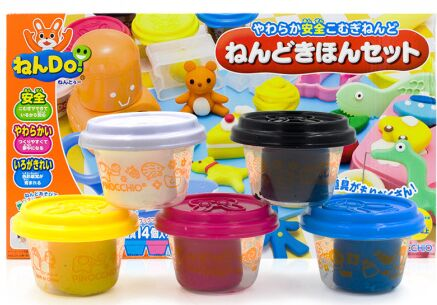

10、B.Toys (美国)

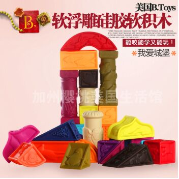

12、DANTOY （丹麦）

高端过家家玩具

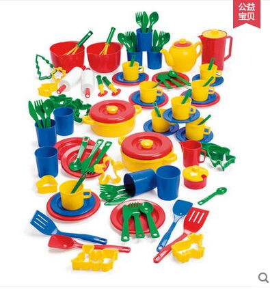

13、BRIO （瑞典）

木玩为主

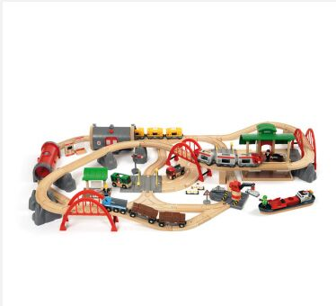

14、乐高 LEGO 

15、澳贝

# 4、洗护

1、加州宝宝 California Baby （美国）

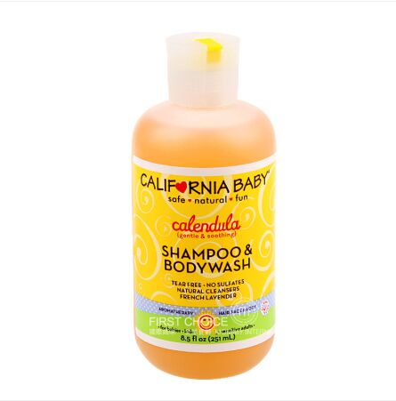

2、艾维诺 Aveeno（美国）

3、施巴  sebamed （德国）

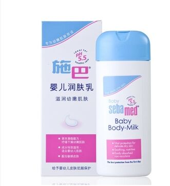

4、甘尼克宝贝 babyganics （美国）

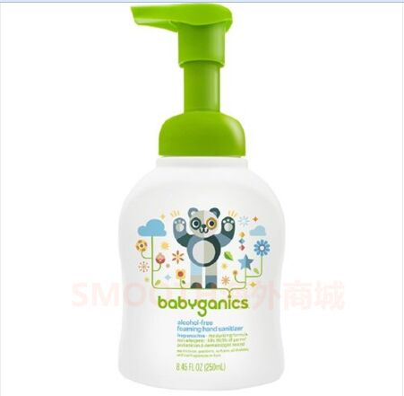

5、小蜜蜂 Burt's Bees （美国）

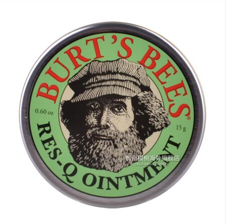

6、哈罗闪 sanosan（德国）

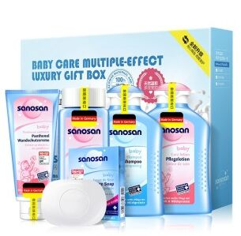

7、妙思乐  mustela （法国）

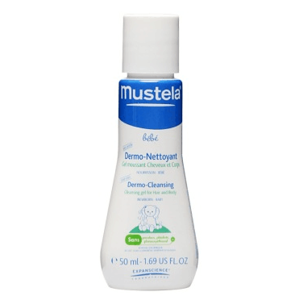

8、强生 Johnson & Johnson （美国）

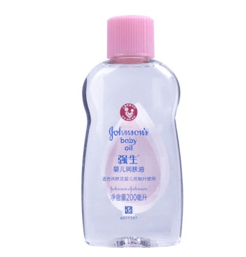

9、贝亲 pigeon（日本）

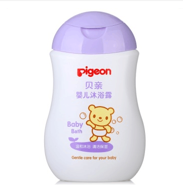

10、国内品牌：

好孩子、郁美净、嗳呵

# 5、奶瓶哺乳

1、美德乐 medela（瑞士）

吸奶器、母乳存储袋 奶包、奶瓶等非常好。

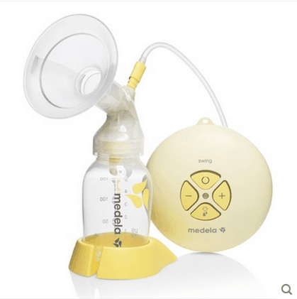

2、新安怡 AVENT（英国）

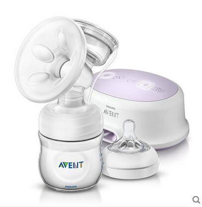 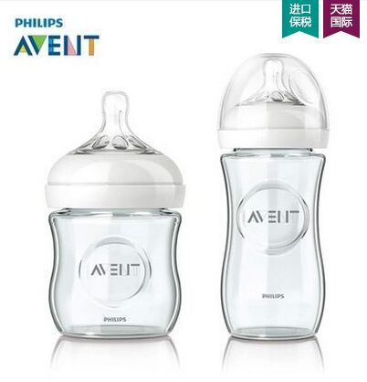

3、贝亲 pigeon（日本）

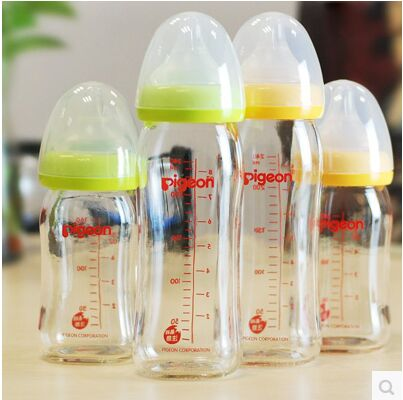

4、NUK（德国）

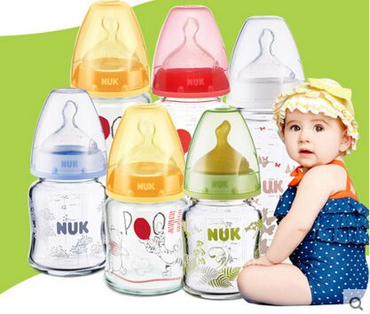

5、可么多么  COMOTOMO （美国）

6、贝塔 betta （日本）

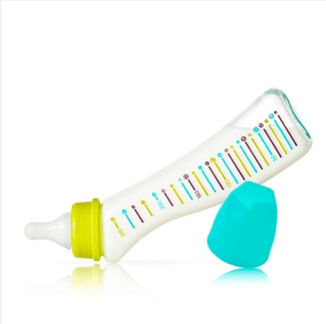

7、国内品牌

 爱得利 乐儿宝 好孩子 日康 亲亲我

# 6、水杯辅食器具

1、膳魔师 THERMOS

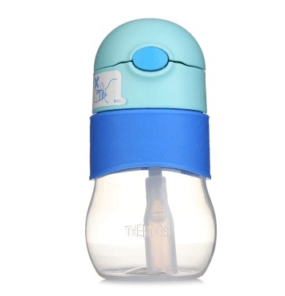 

2、虎牌 tiger （日本）


3、象印 ZO JIRUSHI（日本）


4、努比 nuby（美国)


5、麦肯齐 Munchkin (美国)

6、新安怡 AVENT（英国）
7、贝亲 pigeon（日本）
8、NUK
9、迪士尼 Disney
10、国内品牌

乐儿宝 日康 亲亲我 小白熊 好孩子

# 7、儿童推车

1、Stokke  

推车中的劳斯莱斯


2、英吉利娜  Inglesina

3、奎尼 Quinny


4、babytrend


5、葛莱 GRACO


6、babyzen yoyo


7、mutsy


8、COSATTO


9、康贝 Combi


10、宝得适 Britax


11、JETTE


12、博格步 bugaboo


13、Pouch

14、Gubi


15、爱贝丽 I Believe

16、好孩子 goodbaby


17、小龙哈彼


# 8、婴儿床椅

1、爱音 aing 以餐椅为主。

2、爱斯博儿

3、好孩子

4、小硕士

5、小龙哈彼

6、笑巴喜

7、pouch

8、费雪

# 9、安全座椅

1、德国STM（斯迪姆）

2、德国Recaro（瑞卡罗）

3、德国协和concord（康科德）

4、英国britax（宝得适）

5、荷兰MAXI-COSI

6、瑞典艾贝贝尔

7、美国Graco（葛莱）

8、日本combi（康贝）

9、日本Aprica（阿普丽佳）

# 10、孕妈咪品牌

1、PALMER'S 帕玛氏

2、亲润

3、袋鼠妈妈

4、五羊

5、十月天使

6、孕肤宝

7、英乐士

8、婧麒


