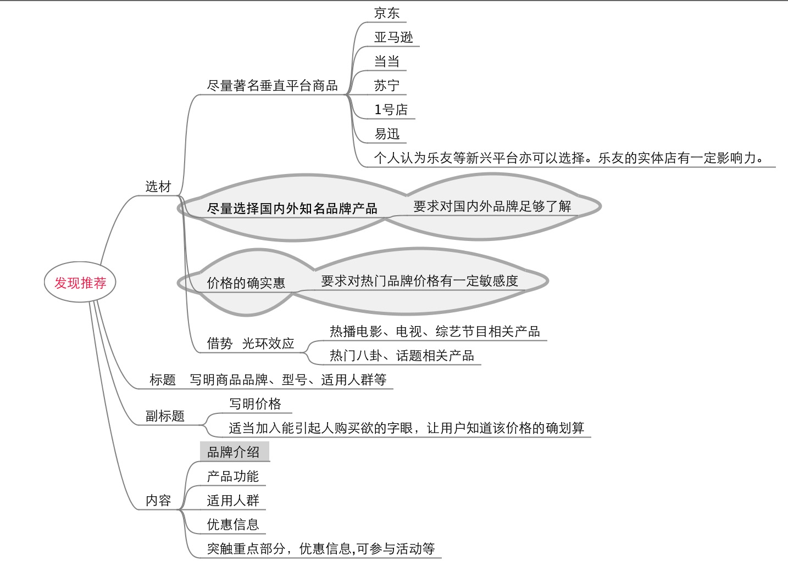
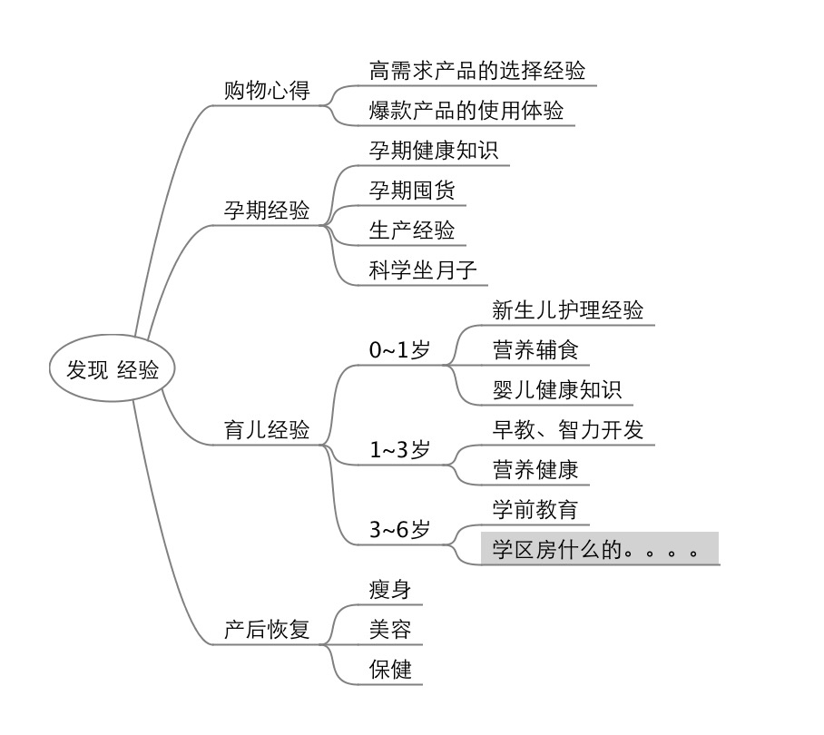
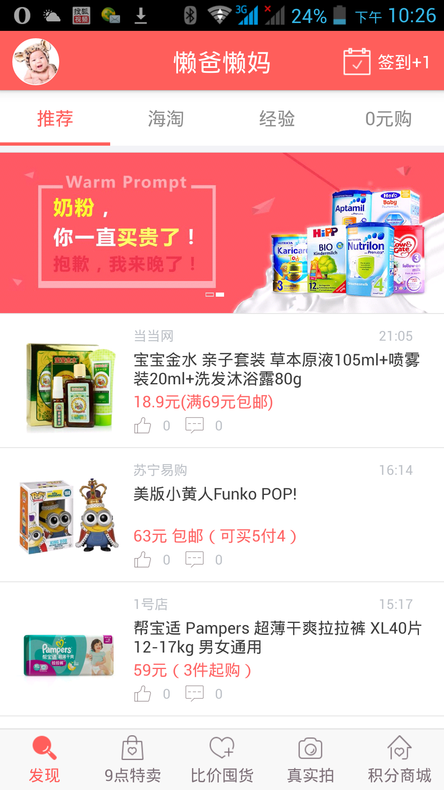

# 1. 发现推荐

# 2. 发现经验

# 3. 关于产品

## 3.1 专题活动

可做一些专题活动，如夏季可做防蚊产品专题，沙滩玩具专题，某品牌夏装专题，9月可做开学季专题。等等等等。。。

## 3.2 个人中心加入宝宝出生年月

做母婴类产品，用户的需求与宝宝的年龄紧密相关，让用户输入宝宝月龄，我们可获得一个至关重要的参数。便于以后分析用户需求。

因不了解技术实现难度和产品后续功能设置，仅供参考。

## 3.3  发现栏目的细分

建议将发现内所有栏目按照宝宝年龄做更细致的分类（包括推荐、海淘、经验）。如孕妈妈、0~1岁、1~3岁、3~6岁、6岁以上。